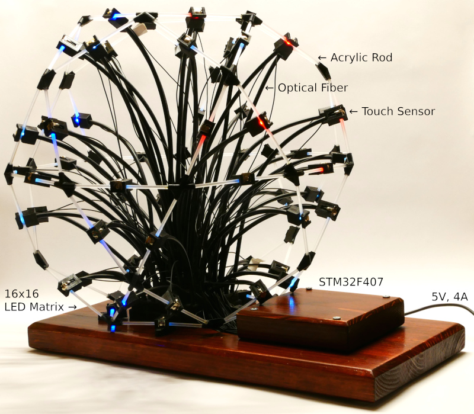
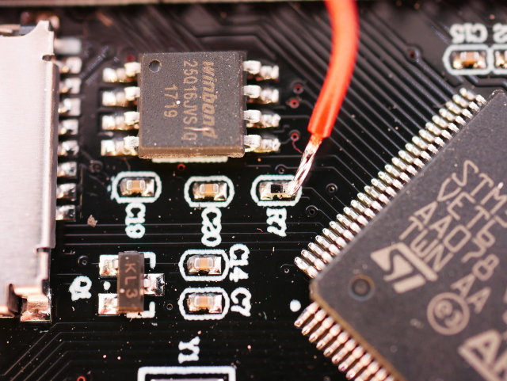

# Icosidodecahedron based Gaming Environment with STM32F407 Controller

## Summary

Project: 
 * Build a "kal-toh"-like (https://memory-alpha.fandom.com/wiki/Kal-toh) gaming platform.
 * Electronic board game on a icosidodecahedron surface
 * The edges of the icosidodecahedron can be selected and are iluminated
 
Icosidodecahedron 
 * 60 edges
 * 30 vertices
 * 32 surfaces (12 pentagonal faces + 20 triangular faces) 

Hardware:
 * 60 sensors: Minus plate of a AA cell block, which is used as capacitive touch sensor fields
 * 60 ilumnated edges: Sanded acrylic rod, iluminated via fiber opical wire from a 16x16 LED matrix
 * 16x16 WS2812 LED Matrix
 * Sensor & fiber optic holder: 3D printed https://github.com/olikraus/scad/tree/master/ikosidodekaeder
 * STM32F407 development board (selected, because the STM32F407 has more than 60 GPIOs for the sensor input)
 * Vertices: 3D printed https://github.com/olikraus/scad/tree/master/ikosidodekaeder
 * 16x16 LED Matrix box: 3D printed https://github.com/olikraus/scad/tree/master/ikosidodekaeder
  
Software:
 * Working example: https://github.com/olikraus/stm32f407/blob/main/ikosi_1/
 * Arduino Environment (https://www.arduino.cc/)
 * STM32Duino (https://github.com/stm32duino)
 * WS2812B access via SPI1 written from scratch: https://github.com/olikraus/stm32f407/blob/main/spi_ws2812b/spi_ws2812b.ino
 * Sensor Algorithm: https://github.com/olikraus/stm32f407/blob/257317d35d1a22a883fa1a342b17f78022364dc2/ikosi_1/ikosi_1.ino#L1153

Result:

 
## Technical Details

### STM32F407 Details
  * STM32F407VET6 (192 KB RAM, 512 KB Flash)
  * STM32duino Project (https://github.com/stm32duino/Arduino_Core_STM32): 
    * SystemCoreClock: 168 MHz
    * APB2: 84 Mhz
    * APB1: 42 Mhz
    * Register Include File: https://raw.githubusercontent.com/stm32duino/Arduino_Core_STM32/main/system/Drivers/CMSIS/Device/ST/STM32F4xx/Include/stm32f407xx.h
    * SysTick: https://github.com/ARM-software/CMSIS_5/blob/develop/CMSIS/Core/Include/core_cm4.h


### STM32F407 Board: https://stm32-base.org/boards/STM32F407VET6-STM32F4XX-M
  * Button K1: PA0 (aktive high)
  * LED D2: PA1 (Sink)


### Boot Mode

The above board doesn't allow to change to change the level at the BOOT0 pin (it is fixed to GND via a resistor).
However BOOT0 is reqired to put the device into programming more for STM32Duino.
This is done by pulling the BOOT0 pin to 3.3V via a small wire, soldered directly on the PCB:


 
### WS2812B LED Matrix
 * Four bits are used to form the waveform pattern for the WS2812B
   https://github.com/olikraus/stm32f407/blob/257317d35d1a22a883fa1a342b17f78022364dc2/ikosi_1/ikosi_1.ino#L355-L363
    * '1000' logical 0 for the WS2812, '1100' logical one for the WS2812B
    * SPI 16 bit mode to transmit 4 bit for the WS2812B
    * APB2 clock (84Mhz) is divided by 32 to get a SPI bitrate of 2.625 MHz = 380ns
    * 380ns are close enough to the expected 400ns of the high pulse of the logical zero for the WS2812B
    * The total transmission of one bit for the WS2812B is 4x380ns=1520ns (4x SPI bit)
  * The WS2812B waveform pattern is generated "on-the-fly" by ISR procedure
    https://github.com/olikraus/stm32f407/blob/257317d35d1a22a883fa1a342b17f78022364dc2/ikosi_1/ikosi_1.ino#L290
    
### Touch Sensor 
 * Sensors connected to one GPIO port are checked in parallel (up to 16 sensors at a time)
 * High clock speed of the the uC (168 MHz): Internal pull down (60k) can be used as discharge resistor 
 * Algorithm: https://github.com/olikraus/stm32f407/blob/257317d35d1a22a883fa1a342b17f78022364dc2/ikosi_1/ikosi_1.ino#L1153
    1. Charge the GPIO pin (set output value to "1")
    2. Change toe GPIO to input mode with internal pulldown resistor
    3. Sample the low/high state all sensor lines for this port
    4. Use binary search to find the sample position high-low transition for each sensor line 
    5. High sample position (long discharge time) means 'not touched'.  

### Arduino Environment

Arduino Pin Numbers:

 PA0 Button K1 
 PA1 LED D2 
 PA2             
 PA3 
 PA4             
 PA5             
 PA6             
 PA7 SPI1_MOSI  
 PA8             
 PA9 USART1_TX            
 PA10 USART1_RX  
 PA11 USART1_CTS  
 PA12 USART1_RTS  
 PA13 SWDIO         
 PA14 SWDCLK  
 PA15           
 PB0             
 PB1             
 PB2             
 PB3             
 PB4             
 PB5             
 PB6             
 PB7             
 PB8             
 PB9             
 PB10           
 PB11           
 PB12 Pin seems to be connected to GND           
 PB13           
 PB14           
 PB15           
 PC0             
 PC1             
 PC2             
 PC3             
 PC4             
 PC5             
 PC6              
 PC7              
 PC8              
 PC9              
 PC10            
 PC11            
 PC12            
 PC13            
 PC14 Not on pin header for this board           
 PC15 Not on pin header for this board           
 PD0              
 PD1              
 PD2              
 PD3              
 PD4              
 PD5              
 PD6              
 PD7              
 PD8              
 PD9              
 PD10            
 PD11            
 PD12            
 PD13            
 PD14            
 PD15            
 PE0              
 PE1              
 PE2              
 PE3              
 PE4              
 PE5              
 PE6              
 PE7              
 PE8              
 PE9              
 PE10            
 PE11            
 PE12            
 PE13            
 PE14            
 PE15            
 PH0              
 PH1              

Alternate pins number

 PA0_ALT1     
 PA0_ALT2     
 PA1_ALT1     
 PA1_ALT2     
 PA2_ALT1     
 PA2_ALT2     
 PA3_ALT1     
 PA3_ALT2     
 PA4_ALT1     
 PA5_ALT1     
 PA6_ALT1     
 PA7_ALT1     
 PA7_ALT2     
 PA7_ALT3     
 PA15_ALT1   
 PB0_ALT1     
 PB0_ALT2     
 PB1_ALT1     
 PB1_ALT2     
 PB3_ALT1     
 PB4_ALT1     
 PB5_ALT1     
 PB8_ALT1     
 PB9_ALT1     
 PB14_ALT1   
 PB14_ALT2   
 PB15_ALT1   
 PB15_ALT2   
 PC0_ALT1     
 PC0_ALT2     
 PC1_ALT1     
 PC1_ALT2     
 PC2_ALT1     
 PC2_ALT2     
 PC3_ALT1     
 PC3_ALT2     
 PC4_ALT1     
 PC5_ALT1     
 PC6_ALT1     
 PC7_ALT1     
 PC8_ALT1     
 PC9_ALT1     
 PC10_ALT1   
 PC11_ALT1   


Handler

```
WWDG_IRQHandler                   /* Window WatchDog              */
PVD_IRQHandler                    /* PVD through EXTI Line detection */
TAMP_STAMP_IRQHandler             /* Tamper and TimeStamps through the EXTI line */
RTC_WKUP_IRQHandler               /* RTC Wakeup through the EXTI line */
FLASH_IRQHandler                  /* FLASH                        */
RCC_IRQHandler                    /* RCC                          */
EXTI0_IRQHandler                  /* EXTI Line0                   */
EXTI1_IRQHandler                  /* EXTI Line1                   */
EXTI2_IRQHandler                  /* EXTI Line2                   */
EXTI3_IRQHandler                  /* EXTI Line3                   */
EXTI4_IRQHandler                  /* EXTI Line4                   */
DMA1_Stream0_IRQHandler           /* DMA1 Stream 0                */
DMA1_Stream1_IRQHandler           /* DMA1 Stream 1                */
DMA1_Stream2_IRQHandler           /* DMA1 Stream 2                */
DMA1_Stream3_IRQHandler           /* DMA1 Stream 3                */
DMA1_Stream4_IRQHandler           /* DMA1 Stream 4                */
DMA1_Stream5_IRQHandler           /* DMA1 Stream 5                */
DMA1_Stream6_IRQHandler           /* DMA1 Stream 6                */
ADC_IRQHandler                    /* ADC1, ADC2 and ADC3s         */
CAN1_TX_IRQHandler                /* CAN1 TX                      */
CAN1_RX0_IRQHandler               /* CAN1 RX0                     */
CAN1_RX1_IRQHandler               /* CAN1 RX1                     */
CAN1_SCE_IRQHandler               /* CAN1 SCE                     */
EXTI9_5_IRQHandler                /* External Line[9:5]s          */
TIM1_BRK_TIM9_IRQHandler          /* TIM1 Break and TIM9          */
TIM1_UP_TIM10_IRQHandler          /* TIM1 Update and TIM10        */
TIM1_TRG_COM_TIM11_IRQHandler     /* TIM1 Trigger and Commutation and TIM11 */
TIM1_CC_IRQHandler                /* TIM1 Capture Compare         */
TIM2_IRQHandler                   /* TIM2                         */
TIM3_IRQHandler                   /* TIM3                         */
TIM4_IRQHandler                   /* TIM4                         */
I2C1_EV_IRQHandler                /* I2C1 Event                   */
I2C1_ER_IRQHandler                /* I2C1 Error                   */
I2C2_EV_IRQHandler                /* I2C2 Event                   */
I2C2_ER_IRQHandler                /* I2C2 Error                   */
SPI1_IRQHandler                   /* SPI1                         */
SPI2_IRQHandler                   /* SPI2                         */
USART1_IRQHandler                 /* USART1                       */
USART2_IRQHandler                 /* USART2                       */
USART3_IRQHandler                 /* USART3                       */
EXTI15_10_IRQHandler              /* External Line[15:10]s        */
RTC_Alarm_IRQHandler              /* RTC Alarm (A and B) through EXTI Line */
OTG_FS_WKUP_IRQHandler            /* USB OTG FS Wakeup through EXTI line */
TIM8_BRK_TIM12_IRQHandler         /* TIM8 Break and TIM12         */
TIM8_UP_TIM13_IRQHandler          /* TIM8 Update and TIM13        */
TIM8_TRG_COM_TIM14_IRQHandler     /* TIM8 Trigger and Commutation and TIM14 */
TIM8_CC_IRQHandler                /* TIM8 Capture Compare         */
DMA1_Stream7_IRQHandler           /* DMA1 Stream7                 */
FSMC_IRQHandler                   /* FSMC                         */
SDIO_IRQHandler                   /* SDIO                         */
TIM5_IRQHandler                   /* TIM5                         */
SPI3_IRQHandler                   /* SPI3                         */
UART4_IRQHandler                  /* UART4                        */
UART5_IRQHandler                  /* UART5                        */
TIM6_DAC_IRQHandler               /* TIM6 and DAC1&2 underrun errors */
TIM7_IRQHandler                   /* TIM7                         */
DMA2_Stream0_IRQHandler           /* DMA2 Stream 0                */
DMA2_Stream1_IRQHandler           /* DMA2 Stream 1                */
DMA2_Stream2_IRQHandler           /* DMA2 Stream 2                */
DMA2_Stream3_IRQHandler           /* DMA2 Stream 3                */
DMA2_Stream4_IRQHandler           /* DMA2 Stream 4                */
ETH_IRQHandler                    /* Ethernet                     */
ETH_WKUP_IRQHandler               /* Ethernet Wakeup through EXTI line */
CAN2_TX_IRQHandler                /* CAN2 TX                      */
CAN2_RX0_IRQHandler               /* CAN2 RX0                     */
CAN2_RX1_IRQHandler               /* CAN2 RX1                     */
CAN2_SCE_IRQHandler               /* CAN2 SCE                     */
OTG_FS_IRQHandler                 /* USB OTG FS                   */
DMA2_Stream5_IRQHandler           /* DMA2 Stream 5                */
DMA2_Stream6_IRQHandler           /* DMA2 Stream 6                */
DMA2_Stream7_IRQHandler           /* DMA2 Stream 7                */
USART6_IRQHandler                 /* USART6                       */
I2C3_EV_IRQHandler                /* I2C3 event                   */
I2C3_ER_IRQHandler                /* I2C3 error                   */
OTG_HS_EP1_OUT_IRQHandler         /* USB OTG HS End Point 1 Out   */
OTG_HS_EP1_IN_IRQHandler          /* USB OTG HS End Point 1 In    */
OTG_HS_WKUP_IRQHandler            /* USB OTG HS Wakeup through EXTI */
OTG_HS_IRQHandler                 /* USB OTG HS                   */
DCMI_IRQHandler                   /* DCMI                         */
0                                 /* CRYP crypto                  */
HASH_RNG_IRQHandler               /* Hash and Rng                 */
FPU_IRQHandler                    /* FPU                          */
```

IRQ handler inside Arduino requires `extern "C"` prefix:
```
extern "C" void __attribute__ ((interrupt)) SPI1_IRQHandler(void)
```